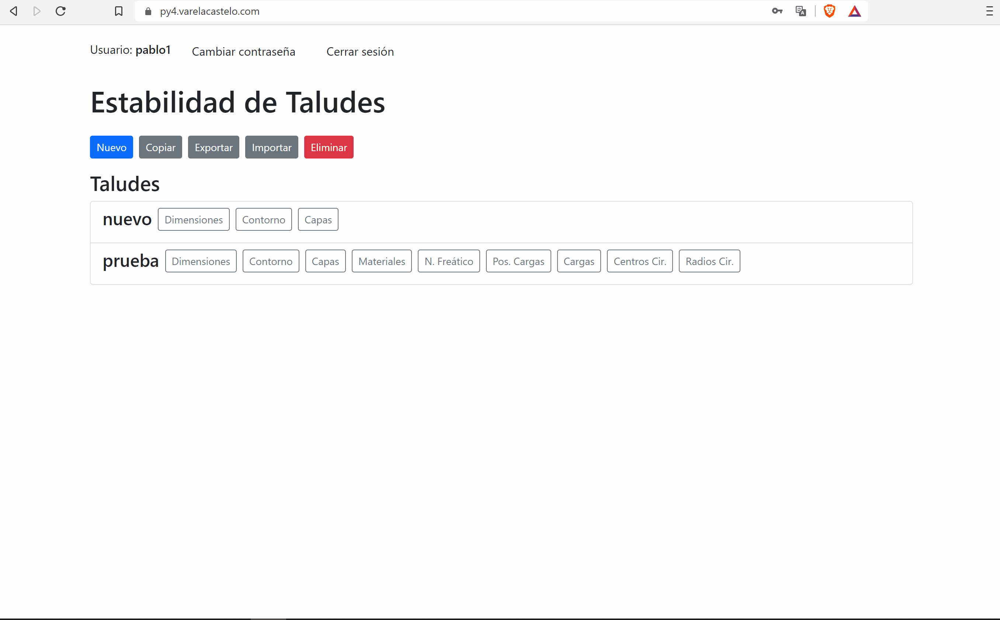

# Description

This is a starter kit for web applications using Vue, Fabric, Python, Flask and Matplotlib.

It was developped as part of a [project](https://tfg.pablo.varelacastelo.com/vue-web-app.pdf) for one of the engineering departments of Universidad de Oviedo. The objetive was creating a didactical application for engineering students: The students use the app to graphically design sloped terrain and then the app quantifies the risk of landslides happening on it.

# Features

The example [website](https://py4.varelacastelo.com/login) consists of:

- Multi-step graphical data entry:

      
    
- Python backend with RESTFul API to store data and generate graphs:

      
    Note: As of this writing the app generates random results. The slope analysis method is to be implemented in a Python function by the engineering department. 

- User authentication and user management:

              

- Data management (copy, import, export, delete):

    

The example website is for slope stability analysis but it is relatively easy to adapt for other purposes.

# Diagram

# Technologies, frameworks, libraries

Frontend:

- Any modern browser
- Vue 3 Composition API
- Fabric
- Axios
- TypeScript

Backend:

- Python 3.8 or higher
- Flask, Flask-JWT-Extended, Flask-RESTful
- Matplotlib

Recommended IDE:

- VS Code
- Volar extension
